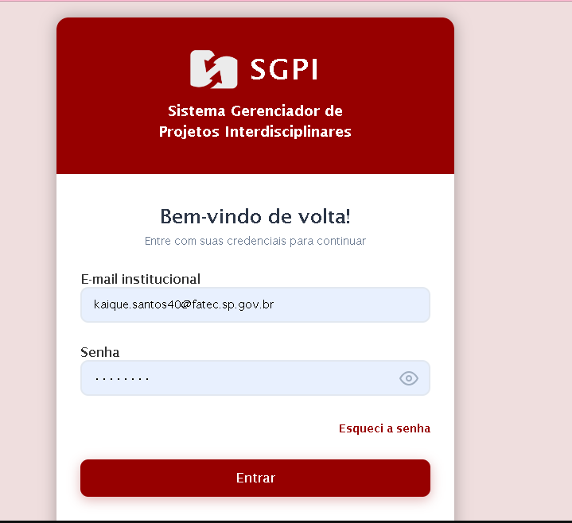
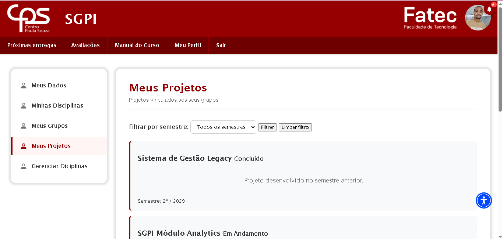
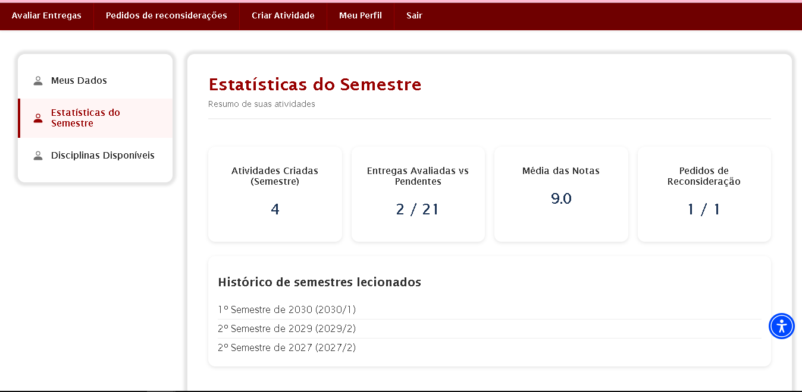
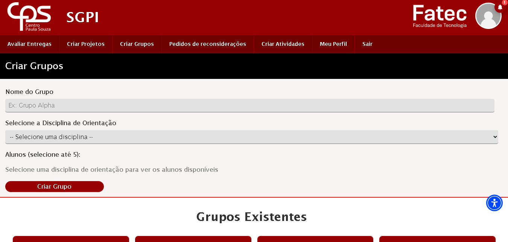
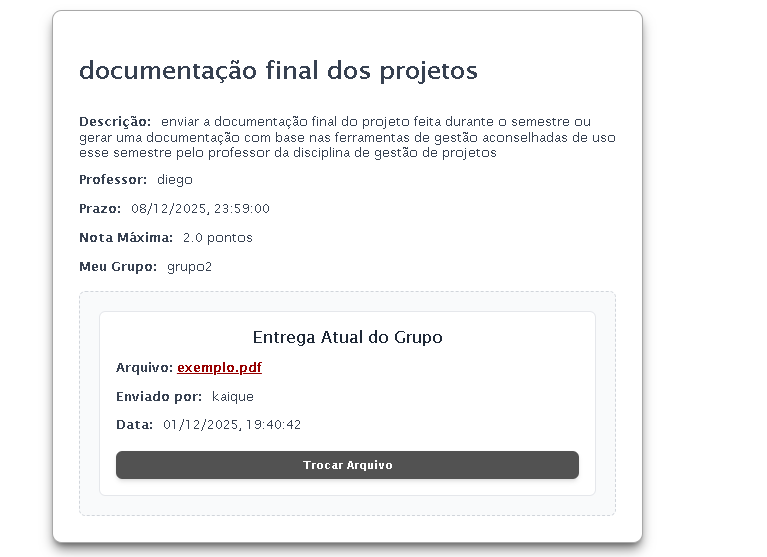
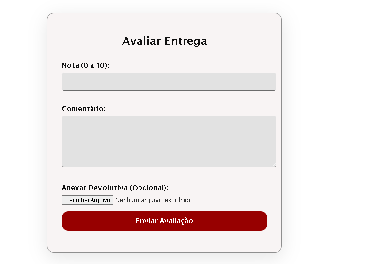
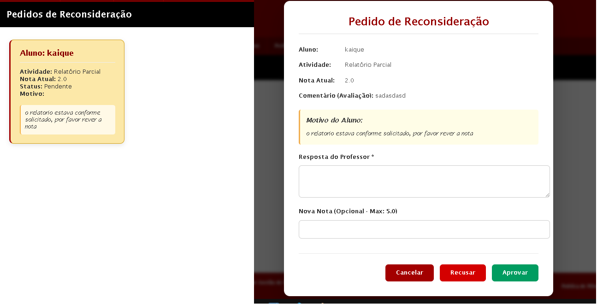
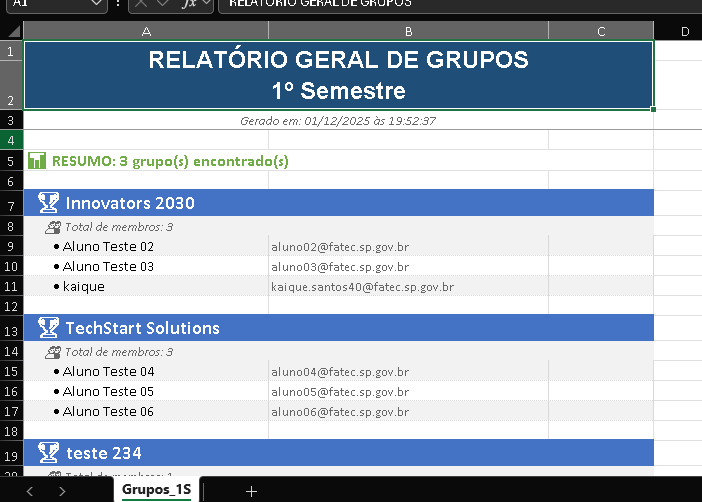
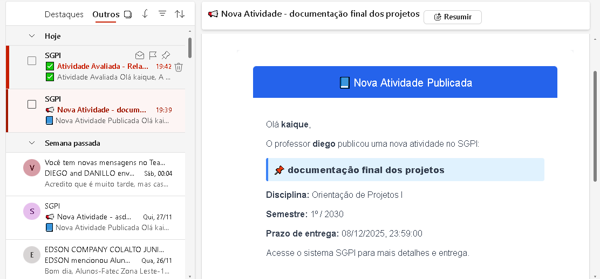

<div align="center">
  
  
  # 🎓 Sistema de Gestão de Projetos Integradores (SGPI)
  
  ### Plataforma completa para gerenciamento acadêmico dos Projetos Integradores do curso de DSM
  
  
  
  
  
</div>

---

## 📖 Sobre o Projeto

O **Sistema de Gestão de Projetos Integradores (SGPI)** é uma plataforma web completa e robusta, desenvolvida especificamente para a **FATEC Zona Leste**, no curso de **Desenvolvimento de Software Multiplataforma (DSM)**. O sistema foi projetado para centralizar e otimizar todos os aspectos do gerenciamento dos Projetos Integradores, desde o cadastro até a avaliação final.

### 🎯 Objetivo

Facilitar o processo acadêmico dos Projetos Integradores através de uma solução integrada que atende às necessidades específicas de todos os envolvidos no processo educacional.

### 👥 Perfis de Usuário

O sistema oferece uma experiência personalizada para cinco perfis distintos:

- 👨‍🎓 **Alunos** 
  - Submissão de entregas com versionamento automático
  - Acompanhamento de prazos e lista de atividades
  - Visualização de notas e feedbacks detalhados
  - Solicitação de reconsideração de notas (15 dias)
  - Dashboard personalizado

- 👨‍🏫 **Professores** 
  - Criação e gestão de atividades com critérios personalizados
  - Sistema de avaliação
  - Devolutivas com arquivos corrigidos
  - Gestão de pedidos de reconsideração
  - Controle de publicação de notas

- 🎯 **Professores Orientadores** 
  - Todas as funcionalidades de professor
  - Acompanhamento especializado dos grupos sob orientação
  - Acompanhamento dos projetos
  - Dashboard com visão consolidada

- 👩‍💼 **Coordenadores** 
  - Visão estratégica do desempenho geral
  - Gestão de semestres e períodos letivos
  - Controle de palavras-chave de acesso das contas professor e orientador
  - Relatórios consolidados (grupo, semestre, orientador)
  - Ativação/desativação de período de matrículas
  - Exportação de dados para CPS

- 🔧 **Administradores** 
  - Controle total do sistema
  - Gestão completa de usuários e permissões
  - Configurações globais do sistema
  - Sistema de auditoria e logs
  - Gerenciamento de disciplinas

---

## 🖼️ Demonstração do Sistema

<div align="center">

### 🔐 Autenticação e Acesso

<table>
<tr>
<td align="center" width="50%">

<br><em>Sistema de login seguro com validação</em>
</td>
<td align="center" width="50%">

<br><em>Cadastro multi-perfil intuitivo</em>
</td>
</tr>
</table>

---

### 🏠 Dashboards por Perfil

<table>
<tr>
<td align="center" width="50%">

<br><em>Dashboard do Aluno - Acompanhamento de projetos</em>
</td>
<td align="center" width="50%">

<br><em>Dashboard do Professor - Avaliações e turmas</em>
</td>
</tr>
</table>


<p><em>Dashboard do Coordenador - Visão geral do desempenho</em></p>

---

### 👥 Gestão de Grupos e Projetos


<p><em>Interface completa para criação e organização de grupos por Diciplina de Orientação</em></p>


<p><em>Sistema de upload de documentos dos projetos</em></p>

---

### 📝 Sistema de Avaliações

<table>
<tr>
<td align="center" width="50%">

<br><em>Interface de avaliação com feedback</em>
</td>
<td align="center" width="50%">

<br><em>Sistema de pedidos de reconsideração</em>
</td>
</tr>
</table>

---

### 📊 Relatórios e Análises


<p><em>Geração automática de relatórios com exportação em excel</em></p>

---

### 🔔 Notificações e Comunicação


<p><em>Sistema integrado de notificações por e-mail e in-app</em></p>

</div>

---

## ✨ Funcionalidades Principais

<table>
<tr>
<td width="50%">

### 🔐 Autenticação & Segurança
- ✅ Login multi-perfil com 5 tipos de usuários
- ✅ Sistema de permissões baseado em roles
- ✅ Chaves de acesso e tokens de sessão
- ✅ Recuperação de senha via e-mail
- ✅ Controle de sessão com timeout automático
- ✅ Compliance LGPD com termos de uso

</td>
<td width="50%">

### 📊 Gestão de Projetos & Grupos
- ✅ CRUD completo de grupos e projetos PI
- ✅ Atribuição de orientadores via chave de acesso
- ✅ Gerenciamento por semestre e disciplinas
- ✅ Dashboard de progresso com métricas
- ✅ Calendário integrado de prazos
- ✅ Sistema de busca e filtros avançados

</td>
</tr>
<tr>
<td width="50%">

### 📝 Atividades & Entregas
- ✅ CRUD de atividades com critérios e anexos
- ✅ Sistema robusto de upload de arquivos
- ✅ Versionamento automático de entregas
- ✅ Controle rigoroso de prazos
- ✅ Histórico completo de submissões
- ✅ Validação de tipo e tamanho de arquivos

</td>
<td width="50%">

### 📊 Avaliações & Feedback
- ✅ Escala de Avaliação Personalizável
- ✅ Lançamento de notas com múltiplos critérios
- ✅ Cálculo automático de médias
- ✅ Devolutivas com arquivos corrigidos
- ✅ Controle de publicação de notas
- ✅ Sistema de reconsideração de notas

</td>

</tr>
<td width="50%">

### 📈 Relatórios & Notificações
- ✅ Relatórios por grupo, semestre e orientador
- ✅ Exportação em Excel e CSV
- ✅ Engine de notificações por e-mail
- ✅ Alertas automáticos de prazos
- ✅ Notificações de feedback publicado
- ✅ Sistema de auditoria com logs

</td>
</table>

---

## 🛠️ Stack Tecnológica

<div align="center">

### Frontend


### Backend


### Principais Dependências


### Banco de Dados


### Ferramentas de Desenvolvimento


</div>

---

## 🏗️ Arquitetura do Projeto

O projeto segue uma **arquitetura MVC robusta e escalável** com clara separação de responsabilidades, desenvolvida em etapas evolutivas ao longo de 6 meses.

### 📂 Estrutura Completa de Diretórios

```
sgpi/
│
├── 📁 backend/
│   ├── 📁 helpers/             # Funções de ajuda (JWT, Respostas)
│   │   ├── 📄 jwt.js
│   │   └── 📄 response.js
│   │
│   ├── 📁 middlewares/         # Interceptadores de requisição
│   │   ├── 📄 auth.js
│   │   ├── 📄 authPerfil.js
│   │   ├── 📄 errorHandler.js
│   │   ├── 📄 notFound.js
│   │   └── 📄 responseMiddleware.js
│   │
│   ├── 📁 routes/              # Definição das rotas da API
│   │   ├── 📄 alunoAtividadesRoutes.js
│   │   ├── 📄 atividadesProfessorRoutes.js
│   │   ├── 📄 atualizarPerfil.js
│   │   ├── 📄 auth.js
│   │   ├── 📄 configRoutes.js
│   │   ├── 📄 CoordenadorProjetos.js
│   │   ├── 📄 CoordenadorRelatorios.js
│   │   ├── 📄 entregas.js
│   │   ├── 📄 grupos.js
│   │   ├── 📄 notificacoes.js
│   │   ├── 📄 painelSemestre.js
│   │   ├── 📄 palavraChave.js
│   │   └── 📄 perfilAcademico.js
│   │
│   ├── 📁 services/            # Lógica de negócios e serviços externos
│   │   └── 📄 emailValidationService.js
│   │
│   ├── 📁 uploads/             # Diretório temporário para uploads
│   │
│   ├── 📁 utils/               # Utilitários do Backend (SQL, Templates, Notificações)
│   │   ├── 📄 emailTemplates.js
│   │   ├── 📄 notificationUtils.js
│   │   ├── 📄 safeRealase.js
│   │   └── 📄 sqlUtils.js
│   │
│   ├── 📁 node_modules/        # Dependências do backend
│   ├── 📄 .env                 # Variáveis de ambiente
│   ├── 📄 .gitignore           # Ignorar arquivos no Git (Backend)
│   ├── 📄 conexaoMysql.js      # Configuração de conexão com Banco de Dados
│   ├── 📄 package-lock.json
│   ├── 📄 package.json
│   └── 📄 server.js            # Ponto de entrada da API
│
├── 📁 frontend/
│   ├── 📁 css/                 # Estilos do sistema
│   ├── 📁 imagens/             # Assets e imagens
│   ├── 📁 views/               # Telas e templates HTML
│   │
│   ├── 📁 javaScript/          # Lógica do Cliente
│   │   │
│   │   ├── 📁 front_end/       # Manipulação direta do DOM e Eventos
│   │   │   └── (Arquivos de lógica de página)
│   │   │
│   │   ├── 📁 services/        # Camada de comunicação com API (Fetch/Axios)
│   │   │   └── (Arquivos de requisição)
│   │   │
│   │   └── 📁 utils/           # Funções auxiliares e reutilizáveis do DOM
│   │       ├── 📄 alerts.js
│   │       ├── 📄 confirmDialog.js
│   │       ├── 📄 descricaoLista.js
│   │       ├── 📄 efeitoMenu.js
│   │       ├── 📄 fetchHelper.js
│   │       ├── 📄 formatDate.js
│   │       ├── 📄 navigation-buttons.js
│   │       ├── 📄 perfilNavigation.js
│   │       └── 📄 visibilidade_senhas.js
│   │
│   └── 📁 node_modules/        # Dependências globais/frontend
│
├── 📄 .gitignore               # Configuração Git global
├── 📄 comentarios.txt          # Anotações do desenvolvimento
├── 📄 package-lock.json
├── 📄 package.json
└── 📄 README.md                # Documentação do projeto 
```

### 🔄 Fluxo de Dados (Arquitetura em Camadas)

```
⬇️  REQUISIÇÃO (Entrada)
┌───────────────────────────────────────────────────────────────┐
│  📡 SERVER / SECURITY                                         │
│  Arquivo: server.js                                           │
│  (Helmet, CORS, Rate Limit, Parser JSON)                      │
└──────────────────────────────┬────────────────────────────────┘
                               │
┌──────────────────────────────▼────────────────────────────────┐
│  🛡️ MIDDLEWARES (Interceptadores)                             │
│  Pasta: /middlewares                                          │
│  (Auth.js, AuthPerfil.js)                                     │
└──────────────────────────────┬────────────────────────────────┘
                               │
┌──────────────────────────────▼────────────────────────────────┐
│  🚦 ROUTES / CONTROLLERS (Gerenciamento de Pedidos)           │
│  Pasta: /routes                                               │
│  (Recebe o pedido, chama validações, decide o fluxo)          │
│  ├── 🛠️ Helpers (jwt.js, response.js)                         │
│  └── 🧪 Utils (validations)                                   │
└──────────────────────────────┬────────────────────────────────┘
                               │
┌──────────────────────────────▼────────────────────────────────┐
│  🧠 SERVICES / BUSINESS LOGIC (Regras de Negócio)             │
│  Pasta: /services & Lógica dentro das rotas                   │
│  (Processamento de dados, Regras complexas, Envio de E-mail)  │
│  └── 📧 Utils (emailTemplates.js, notificationUtils.js)       │
└──────────────────────────────┬────────────────────────────────┘
                               │
┌──────────────────────────────▼────────────────────────────────┐
│  💾 DAL (Data Access Layer)                                   │
│  Arquivo: conexaoMySql.js & sqlUtils.js                       │
│  (Pool de conexões, Queries SQL, Transações)                  │
└───────────────────────────────────────────────────────────────┘
⬇️  RESPOSTA (Saída via responseMiddleware/Global Handler)
```

### 🎯 Evolução da Arquitetura (5 Etapas)

#### **Etapa 1: Modelo MVC Base**
- Estruturação inicial com Routes, Views e JavaScript
- Implementação de RBAC básico
- Separação clara de responsabilidades

#### **Etapa 2: Helpers e Middlewares**
- Criação de funções auxiliares reutilizáveis
- Middlewares de autenticação e autorização
- Centralização de lógica comum

#### **Etapa 3: Separação JavaScript Frontend**
- Organização em `front_end/`, `services/` e `utils/`
- Modularização do código cliente
- Padrão de comunicação API definido

#### **Etapa 4: Refatoração JavaScript**
- Migração para ES6 modules (import/export)
- Eliminação de código duplicado
- Padronização de nomenclatura

#### **Etapa 5: Refatoração CSS**
- Separação de estilos globais e específicos
- Eliminação de duplicações
- Sistema de design consistente

### 📋 Responsabilidades Detalhadas por Camada

#### 🎨 **Frontend (Presentation Layer)**
**Responsabilidades:**
- Renderização de interfaces responsivas (HTML5/CSS3)
- Manipulação de eventos do usuário (JavaScript ES6+)
- Validação de formulários no cliente
- Gerenciamento de estado da aplicação
- Consumo de APIs REST via Fetch
- Cache de imagens e otimização de performance
- Feedback visual ao usuário (loaders, toasts, modals)

**Tecnologias:** HTML5, CSS3, JavaScript Vanilla, UserWay Widget

---

#### 🎮 **Controllers (Route Layer)**
**Responsabilidades:**
- Recepção e validação inicial de requisições HTTP
- Roteamento e delegação para Services
- Formatação de respostas JSON padronizadas
- Tratamento de erros HTTP (400, 401, 403, 404, 409, 422, 500)
- Paginação e filtragem de dados
- Logging de requisições

**Padrão de Resposta:**
```javascript
{
  success: boolean,
  data: any,
  message: string,
  errorCode?: string
}
```

---

#### 💼 **Services (Business Logic Layer)**
**Responsabilidades:**
- Implementação de todas as regras de negócio
- Orquestração de operações complexas multi-tabela
- Validações de domínio específico
- Integração entre múltiplos módulos
- Processamento e transformação de dados
- Gerenciamento de transações
- Chamadas para procedures e triggers

**Exemplos:** Cálculo de médias, validação de prazos, lógica de reconsideração

---

#### 🛡️ **Middlewares (Security & Validation Layer)**
**Responsabilidades:**
- **Autenticação:** Verificação de JWT access/refresh tokens
- **Autorização:** RBAC (Role-Based Access Control)
- **Validação:** Schema validation (Joi) de requisições
- **Segurança:** Rate limiting, CORS, Helmet
- **Logging:** Estruturado com correlationId
- **Auditoria:** Registro de ações críticas
- **Error Handling:** Tratamento global de exceções

---

#### 🔧 **Helpers (Utility Layer)**
**Responsabilidades:**
- Funções reutilizáveis e puras
- Envio de e-mails via Nodemailer
- Manipulação e otimização de arquivos (Sharp)
- Formatação e validação de datas
- Criptografia e hashing (bcrypt)
- Geração de tokens e chaves
- Sanitização de dados
- `sqlUtils.extractRows()`: Normalização de resultados MySQL

---

#### 💾 **Model (Data Access Layer)**
**Responsabilidades:**
- **Pool de Conexões:** MySQL com reuso eficiente
- **Queries Otimizadas:** SQL com índices e prepared statements
- **Transações:** ACID compliance
- **Stored Procedures:** Lógica complexa no banco
- **Triggers:** Automação de históricos e auditoria
- **Migrations:** Versionamento de schema
- **Seeds:** Dados iniciais para dev/test
- **Validação de Integridade:** Constraints e foreign keys

**Otimizações:**
- Índices em colunas de busca frequente
- Índices funcionais (ex: `UPPER(email)`)
- Pool com reuso de conexões
- Binds nomeados para segurança

### 🔐 Segurança em Múltiplas Camadas

```
┌─────────────────────────────────────────────────────┐
│ 1. CORS + Helmet (Headers de Segurança)            │
├─────────────────────────────────────────────────────┤
│ 2. Rate Limiting (Proteção contra Brute Force)     │
├─────────────────────────────────────────────────────┤
│ 3. JWT Authentication (Access + Refresh Tokens)    │
├─────────────────────────────────────────────────────┤
│ 4. RBAC Authorization (Permissões por Role)        │
├─────────────────────────────────────────────────────┤
│ 5. Input Validation (Joi Schema)                   │
├─────────────────────────────────────────────────────┤
│ 6. SQL Injection Prevention (Prepared Statements)  │
├─────────────────────────────────────────────────────┤
│ 7. File Upload Validation (Magic Numbers + Size)   │
├─────────────────────────────────────────────────────┤
│ 8. EXIF Metadata Removal (Privacidade)             │
├─────────────────────────────────────────────────────┤
│ 9. Sensitive Data Sanitization (Logs sem senhas)   │
├─────────────────────────────────────────────────────┤
│ 10. LGPD Compliance (Termos + Política)            │
└─────────────────────────────────────────────────────┘
```

---

## 🚀 Status do Projeto

<div align="center">
  
  
  
</div>

### 📋 Roadmap de Desenvolvimento Completo

#### ✅ **Sprint 1 - Infraestrutura e Autenticação** (Concluída)
- [x] Configuração do banco de dados MySQL
- [x] Migração de Oracle para MySQL
- [x] Arquitetura MVC implementada
- [x] Sistema de autenticação JWT
- [x] RBAC com 5 perfis de usuários
- [x] Sistema de chaves de acesso (8 dígitos alfanuméricos)
- [x] Engine de notificações por e-mail
- [x] Padrão de respostas e tratamento global de erros

#### ✅ **Sprint 2 - Gestão Acadêmica** (Concluída)
- [x] CRUD completo de usuários
- [x] Gestão de disciplinas
- [x] Sistema de semestres com histórico
- [x] Painel de controle de matrículas
- [x] Atribuição de orientadores via chave
- [x] Login multi-perfil funcional

#### ✅ **Sprint 3 - Projetos e Grupos** (Concluída)
- [x] CRUD de grupos com membros e líder
- [x] CRUD de projetos PI
- [x] Vinculação de orientadores
- [x] Sistema de migração de grupos entre semestres
- [x] Recuperação de senha via e-mail
- [x] Compliance LGPD (Termos de Uso)

#### ✅ **Sprint 4 - Atividades e Avaliações** (Concluída)
- [x] CRUD de atividades com critérios
- [x] Sistema de entregas com versionamento
- [x] Upload robusto de múltiplos arquivos
- [x] Escala de Avaliação Personalizável
- [x] Lançamento de notas e cálculo de médias
- [x] Devolutivas com arquivos corrigidos
- [x] Controle de publicação de notas
- [x] Sistema de reconsideração de notas (15 dias)
- [x] Calendário de prazos integrado
- [x] Alertas automáticos de prazos
- [x] Acessibilidade visual (UserWay Widget)

#### ✅ **Sprint 5 - Relatórios, Testes e Finalização** (Concluída)
- [x] Relatórios por grupo, semestre e orientador
- [x] Exportação em PDF, Excel e CSV
- [x] Layout responsivo completo
- [x] Testes de integração
- [x] Testes E2E frontend
- [x] Testes funcionais e de usabilidade
- [x] Dashboard personalizado para cada perfil
- [x] Painel de disciplinas
- [x] Documentação final completa

#### 🔄 **Melhorias Futuras** (Planejadas)
- [ ] Sistema de auditoria completo com rastreabilidade
- [ ] Backup automatizado com procedimentos de recuperação
- [ ] API externa para integração com sistemas institucionais
- [ ] Dashboard com métricas avançadas (Prometheus)
- [ ] Notificações push em tempo real
- [ ] Sistema de chat entre orientadores e grupos

### 📊 Métricas do Projeto

<table align="center">
<tr>
<td align="center"><strong>51</strong><br>User Stories</td>
<td align="center"><strong>48</strong><br>Concluídas</td>
<td align="center"><strong>3</strong><br>Futuras</td>
<td align="center"><strong>~750h</strong><br>Desenvolvimento</td>
<td align="center"><strong>94%</strong><br>Taxa Conclusão</td>
</tr>
</table>

---

## 🚀 Como Executar o Projeto

### Pré-requisitos

Antes de começar, você precisará ter instalado em sua máquina:

```bash
- Node.js (versão 14 ou superior)
- MySQL (versão 8.0 ou superior)
- Git
- NPM ou Yarn
```

### 📥 Instalação

```bash
# Clone o repositório
git clone https://github.com/seu-usuario/sistema-gestao-pis.git

# Acesse o diretório do projeto
cd sistema-gestao-pis

# Instale as dependências
npm install
```

### ⚙️ Configuração

1. **Configure o Banco de Dados MySQL:**

```bash
# Crie o banco de dados
mysql -u root -p

# Dentro do MySQL, crie o banco
CREATE DATABASE sgpi CHARACTER SET utf8mb4 COLLATE utf8mb4_unicode_ci;

# Saia do MySQL
exit;
```

**⚠️ IMPORTANTE - Configuração do Schema:**
- Os scripts de criação do banco estão em `database/` (não versionados no Git por segurança)
- Entre em contato com a equipe de desenvolvimento para obter os scripts completos
- Para ambientes de produção, consulte o DBA da instituição
- Documentação completa do banco disponível na documentação técnica oficial

**Observação:** O sistema utiliza recursos avançados do MySQL:
- Tabelas de histórico para auditoria
- Stored procedures para lógica complexa
- Triggers para automação
- Índices otimizados para performance

2. **Configure as Variáveis de Ambiente:**

Crie um arquivo `.env` na pasta `backend/`:

```env
# ============================================
# BANCO DE DADOS MYSQL
# ============================================
DB_HOST=localhost
DB_PORT=3306
DB_USER=seu_usuario_mysql
DB_PASSWORD=sua_senha_mysql
DB_NAME=sgpi

# ============================================
# SERVIDOR
# ============================================
PORT=3000


# ============================================
# AUTENTICAÇÃO JWT
# ============================================
# IMPORTANTE: Gere chaves fortes e únicas
# Use: node -e "console.log(require('crypto').randomBytes(64).toString('hex'))"
JWT_SECRET=sua_chave_secreta_jwt_aqui
JWT_EXPIRES_IN=1h

# ============================================
# EMAIL (NODEMAILER)
# ============================================
EMAIL_HOST=smtp.gmail.com
EMAIL_PORT=587
EMAIL_SECURE=false
EMAIL_USER=email_institucional@gmail.com
EMAIL_PASSWORD=senha_de_aplicativo_aqui

```

**⚠️ SEGURANÇA CRÍTICA:**
- **NUNCA** commite o arquivo `.env` no Git
- **SEMPRE** use valores diferentes em desenvolvimento e produção
- Para produção, consulte o departamento de TI da instituição
- Gere chaves JWT únicas e fortes (64+ caracteres)
- Use e-mails institucionais da FATEC

### ▶️ Executando a Aplicação

```bash
# Entre na pasta do backend
cd backend

# Inicie o servidor de desenvolvimento
npm start

# Ou com nodemon para auto-reload (desenvolvimento)
npm run dev

# O servidor estará rodando em http://localhost:3000
```

### 👤 Acesso ao Sistema

**⚠️ Configuração de Acesso:**

Por questões de segurança institucional, as credenciais de acesso e dados de seed **não estão incluídas** neste repositório público.

**Para ambientes de desenvolvimento local:**
- Entre em contato com a equipe CODECEPS
- Solicite o pacote de setup de desenvolvimento
- Siga as instruções de configuração inicial fornecidas

**Para implantação institucional:**
- Consulte o departamento de TI da FATEC
- Solicite acesso ao repositório interno com dados sensíveis
- Utilize as credenciais institucionais fornecidas pela coordenação

**Primeiro Acesso (Após Setup):**
- O sistema criará automaticamente um usuário administrador inicial
- As credenciais serão fornecidas durante o processo de instalação
- Altere todas as senhas padrão no primeiro login

---

## 📚 Documentação Adicional

O projeto possui documentação completa e detalhada para facilitar o entendimento, uso e manutenção do sistema:

<table>
<tr>
<td align="center" width="25%">

<br><strong>Documentação Final</strong>
<br><a href="backend/uploads/documents/Documentação Final do Projeto.pdf">Acessar PDF</a>
<br><em>140+ páginas com arquitetura, implementação e testes</em>
</td>
<td align="center" width="25%">

<br><strong>API Documentation (futuramente)</strong>
<br><a href="docs/api.md">Acessar</a>
<br><em>Endpoints, payloads e exemplos de uso</em>
</td>


</tr>
</table>

### 📖 Conteúdo da Documentação Final

A documentação oficial do projeto abrange:

1. **Arquitetura e Implementação Técnica**
   - Estrutura evolutiva do projeto (5 etapas)
   - 10 Fases de implementação detalhadas
   - Cronograma de execução (6 meses)

2. **Frontend**
   - Estrutura e navegação
   - Funcionalidades de cadastro e autenticação
   - Gestão acadêmica completa
   - Sistema de atividades e avaliações
   - Relatórios e notificações
   - Recursos de acessibilidade

3. **Backend**
   - Migração Oracle → MySQL
   - Sistema de autenticação e autorização
   - Rotas e APIs RESTful
   - Gestão de projetos, grupos e atividades
   - Sistema de notificações e jobs

4. **Banco de Dados**
   - Modelagem completa
   - Scripts SQL versionados
   - Testes de mesa e validação
   - Otimizações e índices
   - Procedures e triggers

5. **Plano de Testes**
   - Testes funcionais por perfil
   - Testes de usabilidade
   - Testes de integração
   - Testes E2E frontend

6. **Considerações Finais**
   - Tecnologias utilizadas
   - Padrões e boas práticas
   - Segurança e escalabilidade

---

## 👥 Equipe de Desenvolvimento

<table align="center">
<tr>
<td align="center">
<a href="https://github.com/unrealplastic">

</a>
<br><strong>Nicole Lisboa</strong>
<br><em>Frontend Developer</em>
<br>
<a href="https://github.com/unrealplastic">

</a>
</td>
<td align="center">
<a href="https://github.com/yMistikTK">

</a>
<br><strong>Luiz Carlos</strong>
<br><em>Scrum Master</em>
<br>
<a href="https://github.com/yMistikTK">

</a>
<a href="https://www.linkedin.com/in/luiz-carlos-gimenes-fernandes-de-sousa-045b75198/">

</a>
</td>
<td align="center">
<a href="https://github.com/kaique12santos">

</a>
<br><strong>Kaique Santos</strong>
<br><em>Backend Developer</em>
<br>
<a href="https://github.com/kaique12santos">

</a>
<a href="https://linkedin.com/in/kaique-caitano-b68b992ba">

</a>
</td>
</tr>
<tr>
<td align="center">
<a href="https://github.com/diegomarques23">

</a>
<br><strong>Diego Marques</strong>
<br><em>Documentation Specialist</em>
<br>
<a href="https://github.com/diegomarques23">

</a>
</td>
<td align="center">
<a href="https://github.com/Vini-Crepaldi">

</a>
<br><strong>Vinicius Crepaldi</strong>
<br><em>Database Administrator</em>
<br>
<a href="https://github.com/Vini-Crepaldi">

</a>
</td>
<td align="center">
<!-- Espaço para manter alinhamento -->
</td>
</tr>
</table>

---

## 🤝 Como Contribuir

Contribuições são sempre bem-vindas! Se você tem interesse em melhorar o projeto:

1. 🍴 Faça um fork do projeto
2. 🌿 Crie uma branch para sua feature (`git checkout -b feature/MinhaFeature`)
3. ✅ Commit suas mudanças (`git commit -m 'Adiciona MinhaFeature'`)
4. 📤 Push para a branch (`git push origin feature/MinhaFeature`)
5. 🎉 Abra um Pull Request

### 📝 Padrões de Commit

Seguimos o padrão de commits semânticos:

```
feat: adiciona nova funcionalidade
fix: corrige um bug
docs: atualiza documentação
style: formatação de código
refactor: refatoração de código
test: adiciona testes
chore: tarefas gerais
```

---

## 📄 Licença

Este projeto está sob a licença MIT. Veja o arquivo [LICENSE](backend/License) para mais detalhes.

---

## 🎓 Instituição e Contexto Acadêmico

<div align="center">
  
  
  
</div>

<br>

Este sistema foi desenvolvido como **Projeto Integrador** do curso de **Desenvolvimento de Software Multiplataforma** da **FATEC Zona Leste**, com o objetivo de:

- ✅ Modernizar a gestão dos Projetos Integradores na instituição
- ✅ Centralizar informações acadêmicas de forma organizada
- ✅ Facilitar a comunicação entre alunos, professores e coordenação
- ✅ Fornecer relatórios gerenciais para tomada de decisão
- ✅ Servir como referência para implementação em outras FATECs

### 🌟 Impacto Esperado

O SGPI tem potencial para:
- 📊 Reduzir tempo de gestão administrativa em até 60%
- 🎯 Melhorar acompanhamento de grupos por orientadores
- 📈 Aumentar transparência no processo avaliativo
- 🔄 Facilitar migração de grupos entre semestres
- 🌐 Expandir para outras unidades da rede FATEC

---

## 📞 Suporte e Contato

Encontrou algum problema ou tem sugestões sobre o projeto?

<table>
<tr>
<td align="center" width="33%">

<br><strong>Email para contato</strong>
<br>kaiquecaitano334@gmail.com
</td>
<td align="center" width="33%">

<br><strong>Issues no GitHub</strong>
<br><a href="https://github.com/kaique12santos/sgpi/issues">Reportar Problema</a>
</td>
</tr>
</table>

### 🐛 Reportando Bugs

Ao reportar um bug, por favor inclua:
- Descrição clara do problema
- Passos para reproduzir
- Comportamento esperado vs. obtido
- Screenshots (se aplicável)
- Ambiente (navegador, OS, versão do Node)

### 💡 Sugerindo Melhorias

Adoramos receber sugestões! Para propor melhorias:
- Descreva claramente a funcionalidade desejada
- Explique o problema que ela resolve
- Sugira uma possível implementação
- Considere o impacto em usuários existentes

---

<div align="center">
  
  <br><br>
  
  <h3>💙 Desenvolvido com dedicação pela equipe <strong>CODECEPS</strong></h3>
  
  <p>
    <strong>FATEC Zona Leste</strong> • Desenvolvimento de Software Multiplataforma<br>
    Projeto Integrador • 3º Semestre de 2025
  </p>
  
  <br>
  
  <p>
    <em>"Melhorando a gestão acadêmica através da tecnologia"</em>
  </p>
  
  <br>
  
  <p>
    <a href="https://www.fatec.sp.gov.br">
      
    </a>
    <a href="https://github.com/kaique12santos/sgpi">
      
    </a>
    <a href="#top">
      
    </a>
  </p>
  
  <br>
  
  <sub>Feito com ❤️ para a comunidade de DSM da Fatec ZL</sub>
</div>
